### Hi there 👋

## 📊 GitHub Stats

  
  

---

### 🔧 Setup Instructions for Private Stats

This repository uses GitHub Actions to automatically generate and update GitHub stats cards daily. To display **private contributions**:

1. **Create a Personal Access Token (PAT)**:
   - Go to [Settings → Developer Settings → Personal Access Tokens → Tokens (classic)](https://github.com/settings/tokens)
   - Click "Generate new token (classic)"
   - Select scopes: `repo` and `read:user`
   - Generate and copy the token

2. **Add the token as a repository secret**:
   - Go to this repository's Settings → Secrets and variables → Actions
   - Click "New repository secret"
   - Name: `GH_PAT`
   - Value: Paste your token
   - Click "Add secret"

3. The workflow will automatically use `GH_PAT` if available, otherwise it falls back to `GITHUB_TOKEN` (public stats only).

The stats are updated daily at 3 AM UTC or can be manually triggered via the Actions tab.

---

<!--
**trevorphillipscoding/trevorphillipscoding** is a ✨ _special_ ✨ repository because its `README.md` (this file) appears on your GitHub profile.

Here are some ideas to get you started:

- 🔭 I'm currently working on ...
- 🌱 I'm currently learning ...
- 👯 I'm looking to collaborate on ...
- 🤔 I'm looking for help with ...
- 💬 Ask me about ...
- 📫 How to reach me: ...
- 😄 Pronouns: ...
- ⚡ Fun fact: ...
-->
